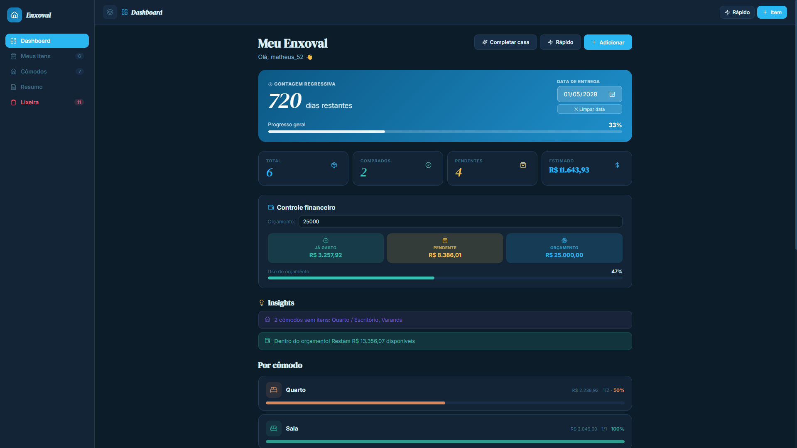
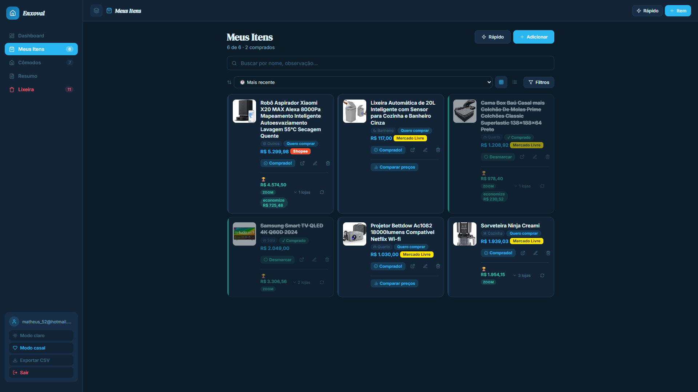
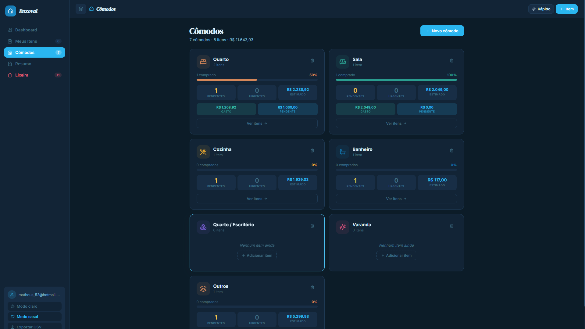
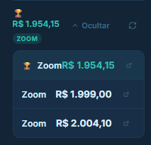
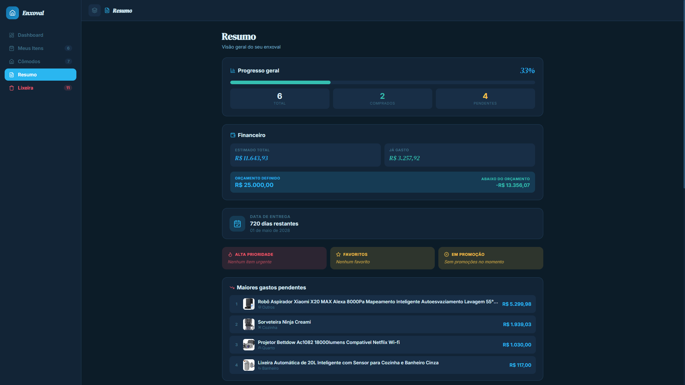

# 🏠 Meu Enxoval

> Lista inteligente de enxoval para casais — organize compras, compare preços e acompanhe o progresso até a mudança.


---

## 📌 Sobre o Projeto

O **Meu Enxoval** nasceu da necessidade real de casais organizarem suas compras antes de uma mudança. Planilhas são complicadas, apps genéricos não têm contexto de enxoval — então construímos uma solução completa e específica.

O app permite que dois usuários compartilhem a mesma lista em tempo real, organizem itens por cômodo, acompanhem gastos, importem produtos diretamente por URL de qualquer e-commerce e recebam sugestões automáticas do que ainda falta comprar.

### Problema que resolve

- ❌ Sem o app: listas no WhatsApp, planilhas desorganizadas, sem controle de orçamento
- ✅ Com o app: lista compartilhada em tempo real, controle financeiro, importação automática de produtos, comparação de preços entre lojas

---

## 🖼 Screenshots

| Dashboard | Meus Itens | Cômodos |
|-----------|-----------|---------|
|  |  |  |

| Comparação de Preços | Resumo Financeiro |
|---------------------|------------------|
|  |  |

---

## ✨ Funcionalidades

### 🔐 Autenticação
- Cadastro e login com e-mail e senha via Supabase Auth
- Recuperação de senha por e-mail com redirecionamento para `/reset-password`
- Persistência de sessão com renovação automática de token
- Tratamento de tokens inválidos/expirados com logout seguro

### 👫 Modo Casal
- Cada usuário possui seu próprio `household` (grupo familiar)
- Compartilhamento via **código de convite** — sem precisar de e-mail do parceiro
- Sincronização em **tempo real** via Supabase Realtime (Postgres CDC)
- Opção de sair do casal e criar lista própria

### 📊 Dashboard
- Contagem regressiva até a data de mudança
- Barra de progresso geral do enxoval
- Cards de resumo: total de itens, comprados, pendentes, estimado
- Controle de orçamento com alerta de estouro
- Insights automáticos (itens urgentes, promoções, progresso)
- Gráficos por cômodo (barras e pizza via Recharts)
- Lista de progresso por cômodo com valor estimado

### 📦 Gerenciamento de Itens
- Adicionar, editar, duplicar e excluir itens
- Status: **Quero comprar** / **Comprado**
- Prioridade: Alta ⚡ / Normal / Baixa
- Favoritar itens (estrela)
- Link direto para produto na loja
- Imagem do produto
- Notas livres
- Histórico de preços (detecta promoções automaticamente)

### 🏠 Cômodos
- Organização por cômodo: Quarto, Sala, Cozinha, Banheiro e mais
- Criação de cômodos customizados com ícone e cor
- Estatísticas por cômodo: progresso, urgentes, valor estimado
- Breakdown de gasto vs pendente por cômodo

### 🤖 Importação Inteligente de Produtos
- Cole qualquer URL de e-commerce e o app detecta automaticamente:
  - Nome do produto
  - Preço
  - Imagem
  - Marca
  - Cômodo sugerido
- Suporte nativo a **Shopee**, **Mercado Livre**, **Amazon**, **Magalu**, **Casas Bahia**, **Americanas** e mais
- Funciona com links encurtados: `br.shp.ee`, `amzn.to`, `meli.me`, `bit.ly`, etc.
- 3 estratégias em cascata por plataforma: API oficial → Scraping → URL fallback

### 💰 Comparação de Preços
- Busca automática de preços em múltiplas lojas
- Fontes: Mercado Livre (API oficial), Amazon, Zoom e Google Shopping
- Exibe até 6 ofertas ordenadas pelo menor preço
- Mostra economia potencial em relação ao preço atual
- Atualização manual a qualquer momento

### 🔍 Filtros e Busca
- Busca por nome e observações
- Filtro por cômodo, status, prioridade
- Filtro por faixa de preço (com presets rápidos)
- Filtro de favoritos e itens em promoção
- Ordenação: recente, A-Z, maior/menor preço, prioridade
- Visualização em grade ou lista

### 💡 Insights Automáticos
- Alertas de itens de alta prioridade pendentes
- Notificação de itens em promoção
- Aviso de orçamento ultrapassado
- Celebração de marcos (75%, 100% comprado)
- Cômodos sem itens cadastrados

### 🗑 Lixeira
- Soft delete (30 dias de retenção)
- Restauração de itens excluídos
- Exclusão permanente individual ou em lote
- Contador regressivo por item

### ✨ Completar Minha Casa (IA)
- Analisa os itens já cadastrados
- Sugere o que falta para um enxoval completo
- Respeita o tamanho do apartamento (Studio até 4+ quartos)
- Sugestões com prioridade e preço estimado
- Seleção individual antes de adicionar

---

## 🗂 Arquitetura do Projeto

```
meu-enxoval/
├── app/                          # Next.js App Router
│   ├── layout.js                 # Layout global + PWA meta + Service Worker
│   ├── page.js                   # Entry point → src/App.js
│   ├── reset-password/
│   │   └── page.js               # Página de redefinição de senha
│   ├── .well-known/
│   │   └── assetlinks.json/
│   │       └── route.js          # Digital Asset Links (TWA/Android)
│   └── api/
│       ├── detect-product/       # Importação inteligente por URL
│       ├── compare-prices/       # Comparação de preços entre lojas
│       └── complete-home/        # Sugestões de enxoval
│
├── src/
│   ├── App.js                    # Componente raiz + estado global
│   ├── components/
│   │   ├── AuthScreen.jsx        # Login, cadastro, recuperação de senha
│   │   ├── HouseholdModal.jsx    # Modo casal (convite + vincular)
│   │   ├── items/
│   │   │   ├── ItemCard.jsx      # Card individual de item
│   │   │   └── TrashView.jsx     # Visualização da lixeira
│   │   ├── modals/
│   │   │   ├── QuickAddModal.jsx # Adicionar rápido (com detecção por URL)
│   │   │   ├── ItemModal.jsx     # Formulário completo de item
│   │   │   ├── RoomModal.jsx     # Criar cômodo
│   │   │   └── CompleteHomeModal.jsx # Sugestões IA
│   │   ├── rooms/
│   │   │   └── RoomCharts.jsx    # Gráficos por cômodo (Recharts)
│   │   └── ui/
│   │       ├── BudgetInput.jsx   # Input de orçamento com debounce
│   │       ├── DeleteButton.jsx  # Botão com confirmação em 2 cliques
│   │       ├── PricePanel.jsx    # Painel de comparação de preços
│   │       ├── PromoBadge.jsx    # Badge de promoção detectada
│   │       ├── StoreBadge.jsx    # Badge colorido por loja
│   │       ├── Toast.jsx         # Notificações temporárias
│   │       ├── InsightCard.jsx   # Card de insight
│   │       ├── Sk.jsx            # Skeleton loading
│   │       ├── Button.jsx        # Botão base reutilizável
│   │       └── Badge.jsx         # Badge inline
│   ├── views/
│   │   ├── Dashboard.jsx         # View principal
│   │   ├── ItemsView.jsx         # Lista de itens com filtros
│   │   ├── RoomsView.jsx         # Grid de cômodos
│   │   └── SummaryView.jsx       # Resumo financeiro e gráficos
│   └── lib/
│       ├── hooks/
│       │   ├── useAuth.js        # Autenticação + household
│       │   ├── useItems.js       # Estado e ações de itens
│       │   ├── useRooms.js       # Estado e ações de cômodos
│       │   ├── useSettings.js    # Configurações do household
│       │   └── useFilters.js     # Reducer de filtros de itens
│       ├── services/
│       │   ├── api.js            # Cliente HTTP para APIs internas
│       │   └── items.service.js  # Queries Supabase de itens
│       ├── utils/
│       │   └── format.js         # fmt, daysLeft, uid, getPromoInfo, etc.
│       ├── constants/
│       │   └── index.js          # Ícones, paleta, lojas, sugestões
│       └── supabase.js           # Cliente Supabase singleton
│
├── lib/
│   └── product-detection/        # Motor de importação de produtos
│       ├── index.js              # Orquestrador (resolve URL → extrai → retorna)
│       ├── resolveUrl.js         # Resolve encurtadores (HEAD redirect chain)
│       ├── extractors/
│       │   ├── shopee.js         # API mobile + scraping + URL fallback
│       │   ├── mercadolivre.js   # API oficial + search + scraping + URL
│       │   ├── amazon.js         # JSON-LD + CSS selectors
│       │   └── generic.js        # Extrator universal (OG + JSON-LD + CSS)
│       └── utils/
│           ├── cleanName.js      # Remove sufixos de loja do nome
│           ├── parsePrice.js     # Normaliza preços BRL → float
│           ├── guessRoom.js      # Infere cômodo pelo nome do produto
│           └── security.js       # Proteção SSRF (bloqueia IPs internos)
│
├── public/
│   ├── manifest.json             # PWA manifest (10 ícones, screenshots, shortcuts)
│   ├── sw.js                     # Service Worker (cache + offline + push)
│   ├── offline.html              # Página offline
│   ├── icon.svg                  # Ícone vetorial
│   ├── .well-known/
│   │   └── assetlinks.json       # Digital Asset Links (fallback estático)
│   └── icons/                    # Ícones PNG (72→512px, maskable, screenshots)
│
├── supabase/
│   └── schema.sql                # Schema completo v3 (tabelas + RLS + triggers)
├── next.config.js                # Headers SW, manifest, well-known, ícones
└── .env.local.example            # Exemplo de variáveis de ambiente
```

### Princípios de arquitetura

| Camada | Responsabilidade |
|--------|-----------------|
| `views/` | Layout e composição de tela, sem lógica de negócio |
| `components/` | UI reutilizável e isolada |
| `hooks/` | Estado React + sincronização com Supabase |
| `services/` | Queries Supabase puras, sem estado React |
| `utils/` | Funções puras testáveis sem dependências |
| `api/` | Lógica de servidor (scraping, APIs externas) |

---

## 🗄 Banco de Dados

### Diagrama de relações

```
auth.users (Supabase Auth)
     │
     └── profiles (1:1)
              │
              └── households (N:1)
                       │
                       ├── rooms (1:N)
                       │
                       ├── items (1:N)
                       │    └── room_id → rooms
                       │
                       └── household_settings (1:1)
```

### Tabelas

#### `households`
| Coluna | Tipo | Descrição |
|--------|------|-----------|
| `id` | UUID | Identificador único |
| `name` | TEXT | Nome do grupo (ex: "Meu Enxoval") |
| `invite_code` | TEXT | Código de 8 caracteres para convite do casal |
| `created_at` | TIMESTAMPTZ | Data de criação |

#### `profiles`
| Coluna | Tipo | Descrição |
|--------|------|-----------|
| `id` | UUID | Referência ao `auth.users.id` |
| `email` | TEXT | E-mail do usuário |
| `household_id` | UUID | Grupo familiar vinculado |
| `created_at` | TIMESTAMPTZ | Data de criação |

#### `rooms`
| Coluna | Tipo | Descrição |
|--------|------|-----------|
| `id` | UUID | Identificador único |
| `household_id` | UUID | Grupo familiar |
| `name` | TEXT | Nome do cômodo |
| `icon` | TEXT | Chave do ícone (ex: "bed", "sofa") |
| `color` | TEXT | Cor hex do cômodo |

#### `items`
| Coluna | Tipo | Descrição |
|--------|------|-----------|
| `id` | UUID | Identificador único |
| `household_id` | UUID | Grupo familiar |
| `room_id` | UUID | Cômodo do item (nullable) |
| `name` | TEXT | Nome do produto |
| `price` | DECIMAL(10,2) | Preço atual |
| `link` | TEXT | URL da loja |
| `image_url` | TEXT | Imagem do produto |
| `notes` | TEXT | Observações livres |
| `status` | TEXT | `want` ou `bought` |
| `priority` | TEXT | `low`, `normal` ou `high` |
| `starred` | BOOLEAN | Favoritado |
| `deleted_at` | TIMESTAMPTZ | Soft delete (null = ativo) |
| `price_history` | JSONB | Histórico `[{price, date, source}]` |
| `price_offers` | JSONB | Ofertas comparadas por loja |

#### `household_settings`
| Coluna | Tipo | Descrição |
|--------|------|-----------|
| `household_id` | UUID | Grupo familiar (PK) |
| `delivery_date` | DATE | Data da mudança |
| `budget_total` | DECIMAL(10,2) | Orçamento total definido |

### Funções SQL customizadas

| Função | Tipo | Descrição |
|--------|------|-----------|
| `my_household_id()` | STABLE SECURITY DEFINER | Retorna o household do usuário logado |
| `handle_new_user()` | TRIGGER | Cria household + perfil + cômodos padrão + settings no cadastro |
| `join_household_by_code(code)` | RPC SECURITY DEFINER | Vincula usuário a outro household via código |
| `update_updated_at()` | TRIGGER | Atualiza `updated_at` em itens automaticamente |

---

## 🔒 Segurança

### Row Level Security (RLS)

Todas as tabelas têm RLS habilitado. Cada usuário só acessa dados do seu próprio `household_id`:

```sql
-- Exemplo: política de leitura em items
CREATE POLICY "items_select" ON items
  FOR SELECT USING (household_id = my_household_id());

-- INSERT usa WITH CHECK (não USING) para cobrir inserções
CREATE POLICY "items_insert" ON items
  FOR INSERT WITH CHECK (household_id = my_household_id());
```

### Proteção SSRF nas APIs

As rotas de API que fazem requests externos bloqueiam IPs internos:

```js
// lib/product-detection/utils/security.js
// Bloqueia: localhost, 127.x.x.x, 10.x.x.x, 192.168.x.x,
//           169.254.169.254 (AWS metadata), metadata.google.internal
```

### Autenticação

- Sessões gerenciadas pelo Supabase Auth com JWT
- Refresh Token renovado automaticamente
- Tokens inválidos detectados via `TOKEN_REFRESH_FAILED` → logout automático
- Redefinição de senha por e-mail com link de uso único (expira em 1 hora)

### Variáveis de ambiente

Nenhuma chave secreta é exposta no frontend. As API Routes do Next.js executam no servidor e nunca expõem credenciais ao cliente.

---

## 🚀 Como Rodar Localmente

### Pré-requisitos

- Node.js 20+
- Conta no [Supabase](https://supabase.com) (gratuita)

### 1. Clone o repositório

```bash
git clone https://github.com/MathNasc/meu_enxoval.git
cd meu_enxoval
```

### 2. Instale as dependências

```bash
npm install
```

### 3. Configure o Supabase

1. Crie um projeto em [supabase.com](https://supabase.com)
2. Acesse **SQL Editor** e execute o conteúdo de `supabase/schema.sql`
3. Anote a **URL** e a **Anon Key** do projeto (Settings → API)

### 4. Configure as variáveis de ambiente

```bash
cp .env.local.example .env.local
```

Edite o `.env.local`:

```env
NEXT_PUBLIC_SUPABASE_URL=https://xxxxxxxxxxxxxxxxxxxx.supabase.co
NEXT_PUBLIC_SUPABASE_ANON_KEY=eyJhbGciOiJIUzI1NiIsInR5cCI6IkpXVCJ9...
```

### 5. Inicie o servidor de desenvolvimento

```bash
npm run dev
```

Acesse: **http://localhost:3000**

---

## 🔑 Variáveis de Ambiente

| Variável | Descrição | Obrigatória |
|----------|-----------|-------------|
| `NEXT_PUBLIC_SUPABASE_URL` | URL do projeto Supabase | ✅ Sim |
| `NEXT_PUBLIC_SUPABASE_ANON_KEY` | Chave anônima pública do Supabase | ✅ Sim |

> ⚠️ **Nunca** commite o `.env.local` no repositório. Ele já está no `.gitignore`.

As variáveis com prefixo `NEXT_PUBLIC_` são expostas ao browser de forma segura — a Anon Key do Supabase é projetada para uso público, com acesso controlado pelo RLS.

---

## ☁️ Deploy

### Vercel (recomendado)

1. Faça fork ou push do projeto para o GitHub
2. Acesse [vercel.com](https://vercel.com) e importe o repositório
3. Configure as variáveis de ambiente em **Settings → Environment Variables**:
   - `NEXT_PUBLIC_SUPABASE_URL`
   - `NEXT_PUBLIC_SUPABASE_ANON_KEY`
4. Deploy automático a cada `git push` na branch `main`

### Supabase — configurações adicionais para produção

Em **Authentication → URL Configuration**:

```
Site URL: https://seu-dominio.vercel.app
Redirect URLs: https://seu-dominio.vercel.app/reset-password
```

### PWA / Android (opcional)

O app é instalável como PWA. Para gerar um APK nativo:

1. Acesse [PWABuilder](https://www.pwabuilder.com)
2. Cole a URL do deploy
3. Gere o APK e anote o `package_name` e `SHA256`
4. Atualize `app/.well-known/assetlinks.json/route.js` com os dados gerados
5. Faça redeploy

---

## 🧪 Scripts disponíveis

```bash
npm run dev      # Desenvolvimento local (http://localhost:3000)
npm run build    # Build de produção
npm run start    # Servidor de produção local
```

---

## 🗺 Roadmap

### Em desenvolvimento
- [ ] Notificações push (infra de SW já implementada)
- [ ] Histórico visual de preços por item (sparkline)

### Planejado
- [ ] **Metas financeiras** — dividir orçamento por cômodo
- [ ] **Listas compartilhadas** — convidar amigos para listas temáticas (chá de casa nova)
- [ ] **Scanner de código de barras** — identificar produto pela câmera
- [ ] **Alerta de preço** — notificar quando produto atingir preço-alvo
- [ ] **Exportar PDF** — lista formatada para impressão
- [ ] **Múltiplas listas** — viagem, bebê, reforma, etc.
- [ ] **Histórico de compras** — relatório mensal de gastos

### Ideias futuras
- [ ] Integração com Pix para registro de pagamentos
- [ ] IA para sugestão de onde comprar com base no histórico
- [ ] App nativo React Native com câmera e notificações nativas

---

## 🛠 Stack Técnica

### Frontend
| Tecnologia | Versão | Uso |
|-----------|--------|-----|
| Next.js | 15 | Framework React com App Router |
| React | 18 | UI e estado |
| Lucide React | 0.400 | Ícones |
| Recharts | 2.12 | Gráficos (barras, pizza) |

### Backend / Infraestrutura
| Tecnologia | Uso |
|-----------|-----|
| Supabase | Auth, banco de dados, Realtime, RLS |
| PostgreSQL | Banco relacional (via Supabase) |
| Next.js API Routes | Scraping, comparação de preços, IA |
| Vercel | Deploy, edge functions |

### Bibliotecas de scraping
| Biblioteca | Uso |
|-----------|-----|
| Axios | Requests HTTP |
| Cheerio | Parser HTML server-side |

### PWA
| Recurso | Implementação |
|---------|--------------|
| Service Worker | Cache offline + push notifications |
| Web App Manifest | Instalação, ícones, shortcuts |
| TWA (Android) | Digital Asset Links via route handler |

---

## 🤝 Contribuindo

1. Fork o projeto
2. Crie sua branch: `git checkout -b feature/minha-feature`
3. Commit: `git commit -m 'feat: adiciona minha feature'`
4. Push: `git push origin feature/minha-feature`
5. Abra um Pull Request

---

## 📄 Licença

Este projeto está sob a licença MIT. Veja o arquivo [LICENSE](LICENSE) para detalhes.

---
